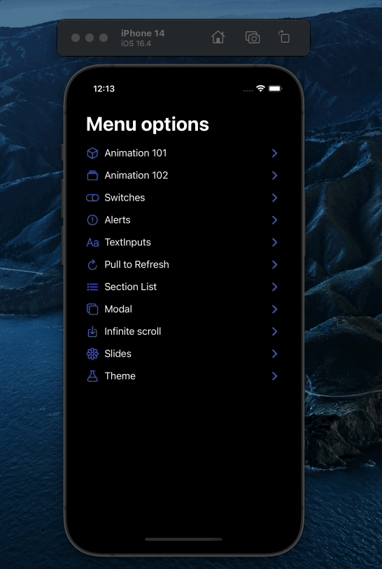
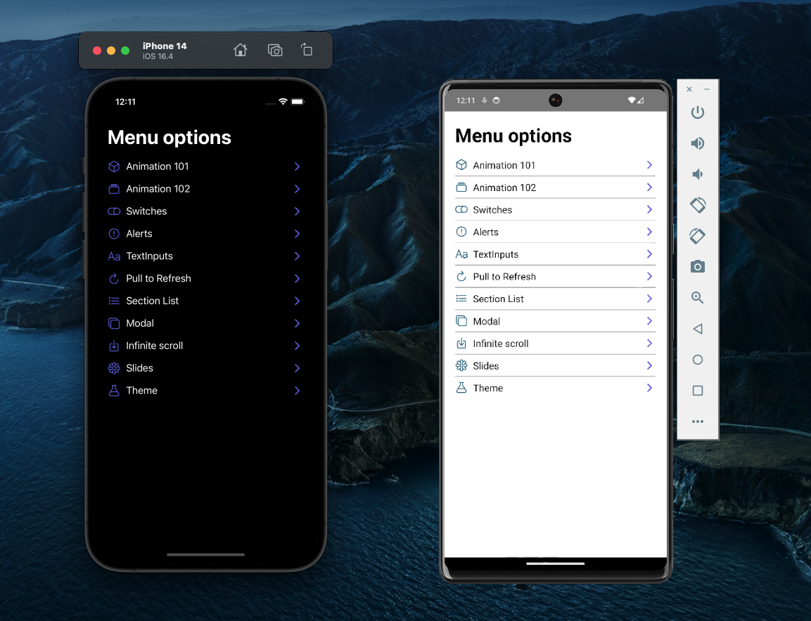

# RN Components

This repository is about react native components and the use of dark mode/ light mode.

## Description

I used for the creation React Native with Typescript.

React Native Version: v0.70.10

Node Version: v18.12.1

Yarn Version: 1.22.19

## Screenshots

### Gif

### Screen capture

